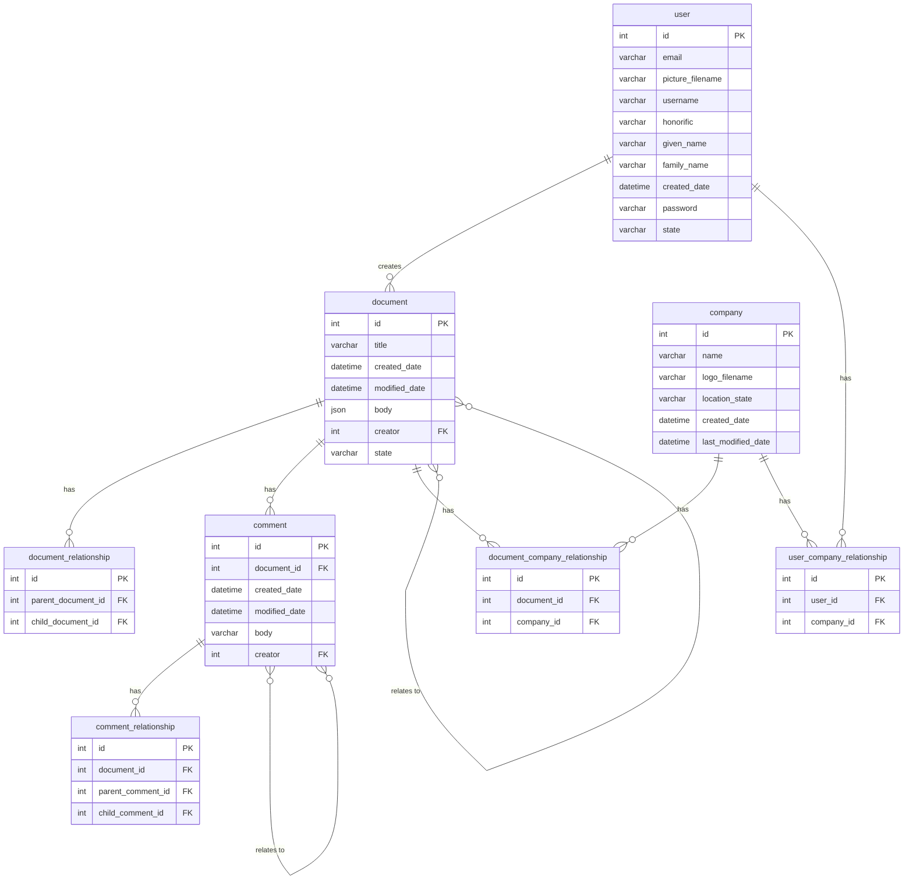

# Medical Models Service

Java Spring Boot service for the Medical Models application. Handles the backend business logic.

If you're interested in the architecture of Medical Models at a high level. Look
here - [medical-models-system-documentation](https://github.com/Medical-Models-Jonathon-Clifford/medical-models-system-documentation).
You'll find system diagrams, descriptions and only one UML diagram!

If you want to see the other services, find them here:

| Service                                       | Repo                                                                                                                           |
|-----------------------------------------------|--------------------------------------------------------------------------------------------------------------------------------|
| Medical Models User Interface                 | [medical-models-ui](https://github.com/Medical-Models-Jonathon-Clifford/medical-models-ui)                                     |
| Medical Models OAuth 2.0 Authorization Server | [medical-models-authorization-server](https://github.com/Medical-Models-Jonathon-Clifford/medical-models-authorization-server) |

## Local Setup

1. Install a Java Development Kit (JDK) of Java 23. For example, you could use [SDKMAN!](https://sdkman.io/) to install
   `23.0.2-amzn` (Amazon Corretto).
2. Clone this repo. For example, to clone using ssh:

```bash
git clone git@github.com:Medical-Models-Jonathon-Clifford/medical-models-service.git
```

3. Navigate into the project directory

```bash
cd medical-models-service
```

4. Install maven dependencies, build the project and run the tests. Note the use of `./mvnw`. This uses a local copy of
   maven specific to this project. You won't need to globally install maven to run this command.

```bash
./mvnw clean install
```

4. Run the application.

```bash
./mvnw spring-boot:run
```

5. Navigate to http://localhost:8081 in a browser to view medical-models-service. You should get a 403 Unauthorized.
   Medical-models-ui and medical-models-authorization-server will handle the authentication.
6. To run the full Medical Models application, run the following steps.
7. Start the medical-models-authorization-server by following its instructions
   here - https://github.com/Medical-Models-Jonathon-Clifford/medical-models-authorization-server
8. Start the medical-models-ui by following its instructions
   here - https://github.com/Medical-Models-Jonathon-Clifford/medical-models-ui
9. Navigate to http://localhost:3000 to see the full application running. You should see a login screen.

## Local Development

It is recommended to use an IDE with good support for Java and Spring like IntelliJ Ultimate. This should give you hot
reloading and other features useful for efficient development - https://www.jetbrains.com/idea/spring/.

1. If you would like to run the application from the command line, execute the following steps.
2. Install dependencies and build the project.
```bash
./mvnw clean install
```
3. Run MySQL locally
```bash
docker compose up
```
4. Run the application.
```bash
./mvnw spring-boot:run
```

5. After making a code change, kill the spring boot process, e.g. with ctrl-c in its terminal, and re-run it.
6. To stop the local MySQL database.
```bash
docker compose down
```

### Skip Tests

Failing tests will fail the build. To skip tests when you run the maven build, use the following:
```bash
./mvnw clean install -DskipTests=true
```

### Skip Checkstyle

Checkstyle is configured to fail the build if it detects a violation. To skip checkstyle when you run the maven build, use the following:
```bash
./mvnw clean install -Dcheckstyle.skip=true
```


## Tooling

| Tool           | Notes                                                                                                              | Docs                                                                |
|----------------|--------------------------------------------------------------------------------------------------------------------|---------------------------------------------------------------------|
| Java           | Robust programming language. High-level, statically typed, just-in-time compiled, memory safe and object oriented. | https://docs.oracle.com/en/java/javase/25/                          |
| Spring         | Inversion of control container for Java.                                                                           | https://docs.spring.io/spring-framework/reference/index.html        |
| Spring Boot    | Opinionated framework for creating production-grade Java applications.                                             | https://docs.spring.io/spring-boot/index.html                       |
| JUnit          | De facto standard for automated testing in Java.                                                                   | https://docs.junit.org/current/user-guide/                          |
| AssertJ        | Rich assertions for JUnit tests.                                                                                   | https://assertj.github.io/doc/                                      |
| Checkstyle     | Generates a report on violations of code style.                                                                    | https://maven.apache.org/plugins/maven-checkstyle-plugin/index.html |
| Thymeleaf      | Server-side template engine for Java.                                                                              | https://www.thymeleaf.org/documentation.html                        |
| Google Guava   | Library of useful collections and utilities for Java.                                                              | https://github.com/google/guava/wiki                                |
| Lombok         | Generates Java boilerplate with annotations.                                                                       | https://projectlombok.org/features/                                 |
| Docker Compose | Useful for running infrastructure dependencies locally. e.g. Databases, Object stores, etc.                        | https://docs.docker.com/compose/                                    |



